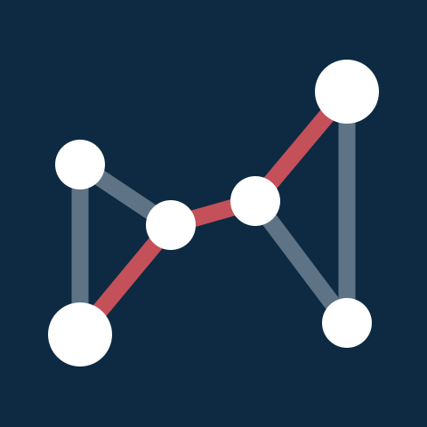

# CORPIDE



HackMTY 2026 — Infosys track ("The Forensic Auditor"). An AI agent that
investigates a synthetic company's financial records, follows the money
through a relationship graph, and produces a defensible fraud case file.

Full spec: [`docs/srs-forensic-auditor-agent.md`](docs/srs-forensic-auditor-agent.md).
Architecture comparison behind the graph-based choice:
[`docs/propuestas-infosys-track.md`](docs/propuestas-infosys-track.md).
Challenge brief + HackMTY research notes:
[`docs/hackmty-2026-infosys-track-brief.md`](docs/hackmty-2026-infosys-track-brief.md).

## Who's doing what

| Person | Role | Branch | Owns |
|---|---|---|---|
| **Aldo** | Data & Graph Engineer | `data-graph` | `data/generator/` (synthetic estate, SAT blacklist ingestion, fraud-pattern injectors), `graph/` (graph builder + all 5 detectors) |
| **Angel** | Agent Engineer | `agent` | `agent/` (ReAct loop, tools, prompts, evidence guardrail, Q&A grounding) |
| **Diego** | Backend/API Engineer | `backend` | `api/` (FastAPI app, SSE streaming, case-file assembly, in-memory state) |
| **Victor** | Frontend/Demo Engineer | `frontend` | `ui/` (Streamlit app: live graph view, case file, scenario injector, Q&A box) |

`shared/schemas.py` is the frozen contract everyone imports from — don't
change it without telling the other three first. Full role details,
dependencies, and an hour-by-hour milestone plan for each person are in
the SRS, [section 8](docs/srs-forensic-auditor-agent.md#8-work-breakdown-for-the-team).

Assignment follows the order names were given (Aldo→Data/Graph,
Angel→Agent, Diego→Backend/API, Victor→Frontend/Demo) — nobody stated a
preference, so swap freely between yourselves if someone wants a
different module. The interfaces in `shared/schemas.py` and the API
contract below don't care whose name is on a branch.

## Repo layout

| Path | Owner | Purpose |
|---|---|---|
| `shared/schemas.py` | everyone (frozen contract) | Pydantic models used across all modules |
| `shared/config.py` | everyone | Ollama connection settings (env / user config file / defaults) |
| `agent/ollama_client.py` | Angel | Client for the LAN Ollama: probe, streaming, cancel, error translation |
| `agent/reasoning_model.py` | Angel | `AGENT_LLM`: sends each ReAct step to Ollama or Snowflake Cortex |
| `agent/cloud.py` | Angel | Gemini: final narrative + `/ask`, with retries and model fallbacks |
| `scripts/check_ollama.py` | everyone | One-command "can I reach the model?" check |
| `data/generator/` | Aldo | Synthetic estate generator, SAT blacklist ingestion, fraud pattern injectors |
| `data/snowflake_client.py`, `data/snowflake_loader.py` | Aldo | Snowflake SQL API + Cortex REST client; loads the estate into the warehouse |
| `graph/` | Aldo | Graph builder + deterministic detectors |
| `graph/sql_detectors.py` | Aldo | `DATA_SOURCE=snowflake`: SQL and Cortex detectors, and the reduced graph |
| `agent/` | Angel | ReAct investigation loop, tools, prompts, evidence guardrail |
| `api/` | Diego | FastAPI backend, SSE streaming, in-memory state |
| `ui/web/` | Victor | **The demo dashboard** — HTML/JS served by the API at `/`, built from the Claude Design canvas |
| `ui/app.py` | Victor | Older Streamlit UI, kept as a fallback; not the one demoed |
| `tests/` | everyone | pytest suite |

## Branches

- `main` — integration branch, and the one that works
- `data-graph` — Aldo
- `agent` — Angel
- `backend` — Diego
- `frontend` — Victor

Work on your own branch and open a PR back into `main` when a module is
ready to integrate. **`git pull` before you start**: after every
integration `main` is fast-forwarded into all four branches, so a branch
you haven't pulled is stale — that is how an evening got spent building
the UI against defaults `main` had already replaced.

## Setup

On Windows (which is what the team is demoing from), use PowerShell:

```powershell
py -3 -m venv .venv
.venv\Scripts\Activate.ps1
pip install -r requirements.txt
copy .env.example .env                # then pick a mode: see "Running modes"

python -m scripts.check_ollama        # only with AGENT_LLM=ollama
python -m pytest -q

# The API also serves the dashboard at http://localhost:8000/
uvicorn api.main:app --port 8000
```

On macOS/Linux:

```bash
python3 -m venv .venv
source .venv/bin/activate
pip install -r requirements.txt

# Aldo, first task: download the real SAT blacklist
python -m data.generator.download_sat_blacklist

# Sanity check: everything imports and the detectors/generator/guardrail work
pytest

# Run the full stack (needs a reasoning model -- see "Running modes" below)
bash scripts/run_dev.sh
```

## Running modes

Three independent switches, all in `.env`. `.env` is read once when the
API starts, so **restart `uvicorn` after changing any of them**.

| Switch | Values | What it decides |
|---|---|---|
| `AGENT_LLM` | `ollama` (default) · `cortex` | Who reasons each step of the investigation: the team's LAN Ollama (`OLLAMA_URL`), or Snowflake Cortex (`CORTEX_MODEL`, default `llama3.1-70b`). |
| `DATA_SOURCE` | `local` (default) · `snowflake` | Where the graph comes from: the whole estate built on this machine, or filtered in the Snowflake warehouse first — SQL detectors plus Cortex reading each invoice's concepto — so only the suspects reach the graph. |
| `CLOUD_LLM_API_KEY` | empty · a Gemini key | Whether Gemini rewrites the final narrative in plain English and answers the judge's `/ask`. |

`AGENT_LLM=cortex` and `DATA_SOURCE=snowflake` both use the same
`SNOWFLAKE_ACCOUNT` and `SNOWFLAKE_PAT`. The evidence guardrail runs the
same way in every mode: no model can put an accusation in the case file
without an edge the guardrail resolves.

### Recipes

**All in the cloud, no laptop on the wifi:**

```env
AGENT_LLM=cortex
CORTEX_MODEL=llama3.1-70b
DATA_SOURCE=snowflake
CLOUD_LLM_API_KEY=<Gemini key>
SNOWFLAKE_ACCOUNT=<ORGNAME-ACCOUNTNAME>
SNOWFLAKE_PAT=<programmatic access token>
```

**Cortex reasons, graph built locally** — no warehouse wait when a judge
injects a scenario: same as above with `DATA_SOURCE=local`.

**The original setup** — the LAN Ollama reasons, Snowflake unused, and
it runs without any Snowflake credentials: `AGENT_LLM=ollama`,
`DATA_SOURCE=local`, plus `OLLAMA_URL` (see "The LAN model" below).

**No keys at all** (plan B, or a teammate without accounts): leave
`CLOUD_LLM_API_KEY` and the `SNOWFLAKE_*` lines empty with
`AGENT_LLM=ollama`. Nothing breaks; the narrative stays the reasoning
model's own, and `/ask` is answered by the reasoning model too.

### What each mode measured

One real investigation per row, all with Gemini on, on 2026-09-12 (seed
42, the team's trial account in GCP us-central1). A model answers
differently run to run, so read the right-hand column as one sample,
not a promise — rehearse the scenario you will demo.

| `AGENT_LLM` | `DATA_SOURCE` | Scenario | Scenario injection | Investigation | Outcome |
|---|---|---|---|---|---|
| `ollama` | `local` | kickback_shell | instant | 497 s | Found the kickback |
| `ollama` | `snowflake` | fake_billing | ~14 s (first after start) | 269 s | Accused the planted phantom supplier |
| `cortex` | `local` | kickback_shell | instant | 66 s | Found the kickback |
| `cortex` | `snowflake` | fake_billing | ~15 s (first after start) | 71 s | Accused a real 69-B supplier; dismissed the phantom |

With `DATA_SOURCE=snowflake` every graph build is a warehouse load plus
four detectors: ~10 s the first time after the API starts, ~4-5 s after,
and the scenario picker builds twice (generate, then inject). **Inject
one throwaway scenario before the judges arrive** so the warehouse and
the caches are warm.

### How to tell what is actually running

- **Sidebar, bottom left.** The main light reads *Model ready* (Ollama)
  or *Cortex ready*; below it *Gemini ready / Gemini: no key*, and,
  only with `DATA_SOURCE=snowflake`, *Data in Snowflake · 21 of 127
  nodes · 4.5 s*. Local data shows no light.
- **The live reasoning log.** With `DATA_SOURCE=snowflake` the first step
  is `[Snowflake: N lead(s) from the warehouse detectors]`; when Gemini
  wrote the narrative, the step before the conclusion says
  `[Gemini rewrote the final narrative …]`.
- **From a terminal:** `curl http://localhost:8000/health/integrations`
  returns the reasoning model, whether Gemini is configured, and how the
  current graph was built (including the error, if Snowflake fell back).

### When something fails

| What fails | What you see | What to do |
|---|---|---|
| Snowflake, with `DATA_SOURCE=snowflake` (bad PAT, warehouse asleep, no network) | The graph is built locally anyway; red *Snowflake failed* light and a *Snowflake did not respond* banner with the error | Fix the credentials, or `DATA_SOURCE=local` and restart |
| Cortex, with `AGENT_LLM=cortex` | The run stops with a `[Snowflake Cortex (llama3.1-70b): …]` step and an empty case file | `AGENT_LLM=ollama` and restart |
| Gemini (no key, quota, a 503 spike) | Retries twice, tries two spare models, then keeps the reasoning model's narrative; `/ask` is answered by the reasoning model | Nothing — this is the plan B |
| The LAN Ollama, with `AGENT_LLM=ollama` | Red *Ollama unavailable* banner and an *Ollama not responding* light; with a Gemini key, one cloud fallback per call | Wake the laptop, or `AGENT_LLM=cortex` and restart |

### Snowflake, once per account

Trial account, warehouse, PAT and the `curl` that must answer 200 before
anything else: [`docs/snowflake-integracion.md`, section 7](docs/snowflake-integracion.md).
Only `llama3.1-70b` answered on the team's account: `llama3.3-70b` needs
cross-region inference, and `mistral-large2`, `llama4-maverick`,
`llama3.1-405b` and `deepseek-r1` are deprecated or legacy there.

## The LAN model (`AGENT_LLM=ollama`)

The agent's loop runs on [Ollama](https://ollama.com) by default, and it
does **not** have to be on your machine: one laptop serves `qwen2.5:7b`
to the whole team over the LAN, so nobody else needs a GPU or a 7 GB
download.

```bash
cp .env.example .env        # then set OLLAMA_URL to the server's IP
python -m scripts.check_ollama     # "can I reach the model?" in one command
```

`OLLAMA_URL` takes whatever shape you were handed — `192.168.1.50`,
`192.168.1.50:11434`, or `http://192.168.1.50:11434/api/generate` — the
client normalizes it. You can also set it from the UI's **Settings >
Model server** panel (server field + "Find models" button), which saves to
`~/.forensic_auditor/config.json`; a `.env` variable overrides that file.

Serving the model to the LAN takes three things on the server side
(`OLLAMA_HOST=0.0.0.0`, port 11434 open to the subnet only, and the
machine not falling asleep) — all of it, plus a troubleshooting table and
the client-isolation trap that breaks this on guest wifi, is in
[`docs/ollama-red-local.md`](docs/ollama-red-local.md).

> Ollama has no authentication. Keep it on the local network, scoped to
> your subnet in the firewall, and never port-forwarded to the internet.

With no `.env` at all, everything falls back to `http://localhost:11434`,
so a solo `ollama pull qwen2.5:7b` still works.

With a Gemini key in `.env`, the client also uses Gemini as a one-shot
fallback if the LAN server disappears mid-demo.

## Status

Initial scaffold: every module has real, runnable logic behind it (not
just empty stubs) — the estate generator produces a working synthetic
data estate with 4 fraud patterns, the graph builder and 5 detectors
run and are unit-tested, the ReAct loop calls Ollama and enforces the
evidence guardrail, the API streams real SSE events, and the UI renders
a live graph and case file against it. Each module still has explicit
`TODO`s marking where the SRS's fuller requirements need to be built
out further (search the codebase for `TODO`). Start from your branch,
your module (table above), and the milestone plan in the SRS
(section 8.2).

**Run this first, or the star detector finds nothing:**

```bash
python -m data.generator.download_sat_blacklist
```

The real Article 69-B list (14,055 RFCs) is not in the repo —
`data/raw/` is gitignored — and without it `num_blacklisted` produces no
listed companies at all. It now warns loudly instead of failing
silently, but the list still has to be downloaded on each machine. It
also changes what `seed=42` generates, so two laptops only agree on the
data once both have it.

Known gaps worth knowing about before you start:
- `total_amount_at_risk` adds up every accusation, so when the agent
  accuses both sides of one payment the peso amount is counted twice
  (`agent/guardrail.py`). Seen with Cortex on kickback_shell: one
  120,000 payment, a 240,000 total.
- With `AGENT_LLM=cortex`, *Stop* takes effect when the current step
  returns (a few seconds): Cortex answers in one piece, so there is no
  stream to interrupt the way there is with Ollama.
- `tests/test_sql_detectors.py` inserts a fake `TESTDESV000XYZ` row into
  the real `SAT_BLACKLIST` table on every run with credentials, and never
  removes it. It is 'Desvirtuado' and matches no supplier, so it is
  harmless, but the rows pile up.
- `generate_clean_control()` is only clean in ~86% of seeds: two clean
  suppliers can collide on a random address and trip
  `shared_attribute_cluster`.
- No detector fills `supporting_edge_ids`, so a detector-only
  accusation reaches the guardrail with no edges to cite and gets
  dropped. The prompt now tells the agent to call `get_neighbors` or
  `trace_payment_path` for a real edge id before accusing, but filling
  the field in `graph/detectors.py` is the proper fix. (The Snowflake
  Cortex lead does fill it, with the phantom invoices' edges.)
