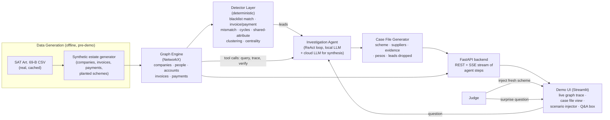

# Software Requirements Specification
## The Forensic Auditor — Infosys Track, HackMTY 2026

**Version:** 1.1
**Date:** 2026-09-12
**Team:** Aldo (Data & Graph), Angel (Agent), Diego (Backend/API), Victor (Frontend/Demo)
**Status:** Draft for team kickoff

---

## 1. Introduction

### 1.1 Purpose

This document specifies the requirements for **The Forensic Auditor**, an AI agent that investigates a synthetic company's financial records, follows the money through a relationship graph, and produces a defensible fraud case file — built for the Infosys challenge track at HackMTY 2026. It is written to let the four of you split work with minimal blocking, by fixing data contracts and module boundaries early.

### 1.2 Scope

In scope: a synthetic data estate (ledger, CFDI-style invoices, bank transactions, supplier master list) grounded in the real SAT Article 69-B blacklist; a graph model of that estate; deterministic detectors; an LLM-driven investigative agent; a case-file generator; a live demo UI that visualizes the money trail and supports a judge injecting a fresh scheme and asking a follow-up question.

Out of scope for the MVP: real client data or real CFDI credentials, a trained GNN/ML scoring model (stretch goal only, see §9.4), a production-grade auth/multi-tenant system, mobile support.

### 1.3 Definitions and acronyms

| Term | Meaning |
|---|---|
| SAT | Servicio de Administración Tributaria — Mexico's tax authority |
| EFOS | Empresas que Facturan Operaciones Simuladas — companies on SAT's Art. 69-B blacklist for issuing fake invoices |
| CFDI | Comprobante Fiscal Digital por Internet — Mexico's standard e-invoice XML format (current version 4.0) |
| RFC | Registro Federal de Contribuyentes — Mexican taxpayer ID, used to identify companies/people in the graph |
| CLABE | Standardized 18-digit Mexican bank account number |
| ReAct | Reasoning + Acting — an agent pattern that interleaves reasoning steps with tool calls |
| Case file | The agent's final structured output: scheme, implicated suppliers, evidence trail, peso amounts, leads dropped |
| Lead | A hypothesis the agent is currently pursuing or has decided not to pursue |

### 1.4 References

- Infosys track brief, "The Forensic Auditor" (HackMTY 2026 Challenge Tracks doc)
- Project doc: `hackmty-2026-infosys-track-brief.md`
- Project doc: `propuestas-infosys-track.md` (architecture comparison, Proposal 1 selected)
- SAT Art. 69-B official CSV: `omawww.sat.gob.mx/cifras_sat/Documents/Listado_Completo_69-B.csv`
- IBM AMLSim: `github.com/IBM/AMLSim`
- IEEE-CIS Fraud Detection (Kaggle): `kaggle.com/competitions/ieee-fraud-detection`

---

## 2. Overall description

### 2.1 Product perspective

Standalone hackathon project: one backend service (graph + detectors + agent + API), one frontend demo app, one offline data-generation pipeline. No integration with real Infosys or SAT systems — SAT's *public* blacklist is the only live external data source used, fetched once and cached locally so the demo has no live-network dependency.

### 2.2 Product functions (high level)

1. Generate a synthetic but structurally realistic company data estate, with 1+ real SAT-blacklisted RFCs blended in among synthetic ones.
2. Build a typed relationship graph from that estate.
3. Run deterministic detectors over the graph to surface candidate leads.
4. Run an LLM agent that investigates leads step by step, using the graph as its evidence source, and stops chasing dead ends.
5. Produce a case file: scheme narrative, implicated suppliers with cited rule + peso amount per claim, full evidence trail, and a list of leads not pursued with reasons.
6. Let a judge (or proctor) inject a fresh, previously-unseen fraud scheme into the data estate at demo time.
7. Visualize the investigation live — graph view with the traced path animating as the agent finds it.
8. Accept one free-text follow-up question after the case file is produced, and answer it grounded in the same evidence graph.

### 2.3 User classes

| User class | Description | Primary need |
|---|---|---|
| Judge | Evaluates against Results/Judgment/Feasibility/Clarity | A clear, defensible case file and a live, inspectable trace |
| Demo presenter (team) | Runs the live demo | Reliable, fast, narratable UI |
| "Finance/audit team" (feasibility persona) | Hypothetical real-world user the Feasibility criterion asks the team to imagine | A case file they could act on without redoing the work |

### 2.4 Recommended technology stack

Chosen to minimize integration risk within a ~30-36 hour build window and to let all four of you work in parallel against frozen contracts (see §8).

| Layer | Choice | Why |
|---|---|---|
| Core language | **Python 3.11+** | One language across data generation, graph, detectors, and agent — reduces context-switching for a 4-person team; strong libraries for every other layer below. |
| Graph engine | **NetworkX** (in-memory) | Zero infrastructure to stand up or debug live; expressive enough for cycle detection, connected components, centrality at the scale this demo needs (hundreds of nodes, not millions). Neo4j was considered and rejected for MVP — it adds a server dependency and a query language (Cypher) to learn under time pressure, for a benefit (fancier native viz) the custom frontend already covers. |
| Backend API | **FastAPI** | Async-friendly for streaming agent steps to the UI (SSE/WebSocket), automatic OpenAPI docs double as the interface contract between backend and frontend. |
| LLM / agent runtime | **Ollama running a local model (e.g., Llama 3.1 8B or Qwen2.5 7B, function-calling capable) as the primary loop driver, with a cloud model (Claude or Gemini, whichever the team has a key for) reserved for the final case-file synthesis and the live Q&A step** | Directly follows the brief's own guidance: the investigation loop makes many calls, so the free/local model absorbs that volume; the more expensive, higher-quality cloud call is spent only where it's seen (the final narrative and the answer to the judge's surprise question), where quality matters most and volume is low (1-2 calls). A disk-backed cache (key = prompt + tool-context hash) avoids re-paying for repeated sub-investigations during development and rehearsal. |
| Agent pattern | **Hand-rolled ReAct loop with native tool/function calling** (not a heavy framework like LangChain/LangGraph) | Fewer moving parts to debug live; full control over the "cite evidence or refuse" guardrail (§5.4), which is easier to enforce as an explicit post-processing check than to trust to a framework's default behavior. |
| Data generation | **Custom Python generator, patterned on AMLSim's known fraud topologies** (fan-out, cycles/round-tripping, gather-scatter), rather than running AMLSim's Java pipeline directly | AMLSim is real and a good design reference, but its Java toolchain is extra setup risk for a Python-only team under time pressure. Reimplementing just the topologies needed (a few hundred lines) is safer. Running actual AMLSim is listed as a stretch goal (§9.4) if someone wants the extra realism and has spare time. |
| Real-data anchor | **SAT Art. 69-B CSV**, downloaded once, cached as a local file | Confirmed free, official, and directly downloadable — no scraping or paid mirror needed. |
| Invoice format | **CFDI 4.0-shaped fields** (UUID, RFC emisor/receptor, monto, forma de pago, uso CFDI, conceptos) modeled as a Python dataclass / JSON schema, not full XML+XSD validation | Gets the structural realism judges will recognize without spending build time on XML tooling that adds no investigative value. |
| Frontend / demo | **Streamlit** for the primary build, with an embedded network-graph component (`streamlit-agraph` or `pyvis`) | Fastest path to a working, animatable graph view for a team that may not have a dedicated frontend specialist; stays in Python so Victor can read backend code directly. If Victor is confident in React, a React + `react-force-graph`/Cytoscape.js app consuming the same FastAPI/SSE contract is an equally valid stretch upgrade (§9.4) — the API contract in §7 is designed to support either. |
| Storage | **In-memory graph + JSON snapshots on disk** (no database) | Nothing here needs to survive a restart beyond the demo session; a database is infrastructure the team would only debug, never benefit from, in this timeframe. |

### 2.5 Constraints

- Hackathon time budget (~30-36 hours from kickoff to submission); see §8 for the milestone plan.
- No real client or production financial data — synthetic + public SAT blacklist only.
- LLM call volume must stay within whatever free-tier/local capacity the team has on demo day; §5 requirements include an explicit call budget.
- Team has 4 developers (Aldo, Angel, Diego, Victor); module boundaries in §8.1 are drawn to keep each person largely unblocked by the others after the first few hours.

### 2.6 Assumptions and dependencies

- The team can reach the internet at least once before the demo to download the SAT CSV (cached afterward — no live dependency during the demo itself).
- At least one team laptop can run a local Ollama model at usable speed (tested in the first milestone, §8.2, precisely so a fallback plan exists early if not).
- HackMTY 2026's exact schedule/venue is still unconfirmed publicly as of this writing; the milestone plan in §8 is expressed in relative hours so it can be mapped onto whatever the actual event window turns out to be.

---

## 3. System architecture

Module boundaries map directly onto the split in §8.1: Data/Graph (**Aldo**), Agent (**Angel**), Backend API/Case File (**Diego**), Frontend/Demo (**Victor**).

---

## 4. Data requirements

### 4.1 Graph entity model

**Node types**

| Node | Key attributes |
|---|---|
| `Company` | `rfc`, `name`, `address`, `phone`, `industry`, `incorporation_date`, `is_audited_entity` (bool — the one company under investigation), `blacklist_status` (`none`/`presunto`/`definitivo`/`desvirtuado`/`sentencia_favorable`) |
| `Person` | `id`, `name`, `role` (`owner`/`legal_rep`/`employee`) |
| `BankAccount` | `account_id`, `clabe`, `bank_name` |
| `Invoice` | `uuid`, `folio`, `emisor_rfc`, `receptor_rfc`, `amount`, `date`, `uso_cfdi`, `forma_pago`, `metodo_pago`, `concepts[]` |
| `Payment` | `transaction_id`, `from_account`, `to_account`, `amount`, `date`, `reference` (optionally linking to an `Invoice.uuid`) |

**Edge types**

| Edge | From → To | Meaning |
|---|---|---|
| `ISSUED_INVOICE` | Company → Invoice | Company is the emisor |
| `RECEIVED_INVOICE` | Invoice → Company | Company is the receptor |
| `EXECUTED_PAYMENT` | BankAccount → BankAccount | A payment moved money |
| `OWNS_ACCOUNT` | Company/Person → BankAccount | Account ownership |
| `LEGAL_REP_OF` / `OWNS_COMPANY` | Person → Company | Corporate control |
| `SHARES_ADDRESS` / `SHARES_PHONE` | Company ↔ Company | Derived at graph-build time when two companies match on a raw attribute |
| `SHARES_BANK_ACCOUNT` | Company ↔ Company | Derived when two companies route funds through the same account |
| `BLACKLISTED_AS` | Company → SAT69BRecord | Present only for companies matched against the real SAT CSV |

### 4.2 Data acquisition plan

1. **SAT Art. 69-B list** — download `omawww.sat.gob.mx/cifras_sat/Documents/Listado_Completo_69-B.csv` once, store as `data/raw/sat_69b.csv`, refresh only if stale by demo day. Parse into RFC → status lookup.
2. **CFDI 4.0 field reference** — pull SAT's published CFDI 4.0 field list/XSD as a reference for which fields to include in synthetic invoices (structural fidelity only, no schema validation needed for MVP).
3. **AMLSim patterns** — read `github.com/IBM/AMLSim`'s documented transaction patterns (fan-out, cycle, gather-scatter, bipartite) as the spec for the custom generator in §2.4; do not depend on running AMLSim's own pipeline for MVP.
4. **IEEE-CIS (optional)** — only pulled if the team pursues the ML-scoring stretch goal (§9.4); not required for MVP.

### 4.3 Synthetic estate sizing (target for demo)

One audited company, 15-30 suppliers (2-4 of them genuinely SAT-blacklisted, 2-3 more that merely *look* suspicious but are clean — this is the false-accusation trap the brief calls out), 50-150 invoices, 50-150 payments, 1-2 planted fraud schemes for the pre-built rehearsal scenario, plus a clean control scenario with zero planted fraud (used for the Judgment acceptance test, §10).

---

## 5. Functional requirements

### 5.1 Data & graph module — **owner: Aldo**

- **FR-1**: The system shall generate a synthetic data estate (companies, people, bank accounts, invoices, payments) as described in §4.3, parameterized by a random seed for reproducibility.
- **FR-2**: The system shall blend real SAT Art. 69-B RFCs into the synthetic supplier list so that blacklist matches are genuine, not fabricated.
- **FR-3**: The system shall build a typed graph (§4.1) from the generated estate.
- **FR-4**: The system shall expose a **Scenario Injector** — a script or UI action that adds a new instance of a fraud pattern (fake billing, kickback-via-shell, round-tripping, inflated sales) into an existing estate/graph without code changes, so a judge or proctor can seed an unseen case live.

### 5.2 Detector layer — **owner: Aldo** (deterministic, run before the agent starts)

- **FR-5**: Blacklist detector — flag every `Company` whose RFC matches a SAT 69-B record.
- **FR-6**: Invoice/payment mismatch detector — flag invoices with no matching payment, payments with no matching invoice, or amount mismatches beyond a configurable tolerance.
- **FR-7**: Cycle detector — find directed payment cycles up to a configurable hop limit (round-tripping / kickback loops).
- **FR-8**: Shared-attribute clustering — group companies connected via `SHARES_ADDRESS`, `SHARES_PHONE`, or `SHARES_BANK_ACCOUNT` into candidate shell-company clusters.
- **FR-9**: Centrality detector — flag nodes with disproportionately high betweenness/pass-through volume relative to their apparent size.
- **FR-10**: Each detector shall output *leads* (candidate entities/edges with a reason code), never a final verdict — verdicts are the agent's job, not the detector's.

### 5.3 Investigation agent — **owner: Angel**

- **FR-11**: Given an initial hint (e.g., "invoice #X looks unusual" or a detector's top lead), the agent shall form an initial hypothesis and begin an investigation loop.
- **FR-12**: The agent shall have tool access to: `query_entity(id)`, `run_detector(name, params)`, `get_invoice(uuid)`, `trace_payment_path(from, to)`, `check_blacklist(rfc)`, `get_neighbors(node_id, edge_type)`.
- **FR-13**: The agent shall iterate: hypothesis → tool call → observation → refine or abandon the lead, up to a configurable maximum number of steps/tool calls per investigation (call budget, tied to NFR-3).
- **FR-14**: For every lead the agent abandons, it shall log a one-line reason (e.g., "single unmatched payment, no cycle, not blacklisted — insufficient pattern").
- **FR-15**: The agent shall use the local model (Ollama) for all intermediate reasoning/tool-selection steps, and reserve the cloud model call(s) for final case-file synthesis and the live Q&A response (FR-19).

### 5.4 Evidence and accusation guardrail — **owner: Angel**

- **FR-16**: The system shall not include any supplier in the case file's "implicated" section unless at least one specific graph edge (with a cited rule broken and peso amount) supports the claim.
- **FR-17**: A validation step shall run after the agent produces its draft case file, rejecting/stripping any accusation that does not resolve to a real edge ID in the graph, before the case file is finalized. This is the concrete mechanism behind the brief's "refuse to name a supplier it cannot back up" and is the primary target of the Judgment criterion.

### 5.5 Case file output — **owner: Angel (content) / Diego (assembly & delivery)**

- **FR-18**: The case file shall contain: a plain-language scheme narrative, the list of implicated suppliers (each with rule broken + evidence citation + peso amount), the full evidence trail (the extracted subgraph, as both a visual and a structured list), and the list of leads considered but not pursued with reasons (FR-14).
- **FR-19**: After the case file is produced, the system shall accept one free-text follow-up question and answer it using the same tool-calling capability, grounded in the investigation's evidence graph — not from unconstrained model memory.

### 5.6 Demo interface — **owner: Victor**

- **FR-20**: The UI shall render the graph and animate the traced path as the agent's steps stream in (via SSE/WebSocket from the backend).
- **FR-21**: The UI shall display the case file in a non-technical, readable layout (Clarity criterion) with an option to expand into the raw evidence list (Results/Judgment criteria — for when a judge wants to verify).
- **FR-22**: The UI shall expose the Scenario Injector (FR-4) and the follow-up question box (FR-19) as demo-operator-facing controls.

---

## 6. Non-functional requirements

| ID | Requirement |
|---|---|
| NFR-1 | **Explainability** — every claim in the case file must be traceable to a specific node/edge ID in the graph (supports FR-17 and the Judgment/Clarity criteria). |
| NFR-2 | **Reproducibility** — detectors are deterministic; agent temperature is kept low; every demo run is seed-logged so a run can be repeated if something goes wrong live. |
| NFR-3 | **Performance** — a full investigation (hint → case file) should complete within roughly 60-90 seconds, leaving time in the 3-minute demo slot for narration and the Q&A step; this bounds the agent's step budget (FR-13). |
| NFR-4 | **Cost/rate-limit safety** — the local model absorbs the high-volume intermediate steps; cloud-model calls per investigation are capped at a small, explicit number (target: ≤2). |
| NFR-5 | **Reliability** — if the cloud model or network is unavailable, the system falls back to local-model-only mode rather than failing the demo. |
| NFR-6 | **Privacy** — only synthetic data plus the public SAT blacklist is used; no real client or personal data enters the system. |
| NFR-7 | **Usability** — the case file must be readable by a non-engineer (the Feasibility persona), not just a JSON dump. |
| NFR-8 | **Maintainability for 4 concurrent developers** — module boundaries and interface contracts (§7, §8.1) are frozen early enough that each person can build and test against mocks before integration. |

---

## 7. External interface requirements (backend ↔ frontend contract)

Frozen early (target: within the first 2 hours) so **Diego** and **Victor** can build in parallel against mock responses matching this shape.

| Endpoint | Method | Purpose |
|---|---|---|
| `/estate/generate` | POST | Generate/reset a synthetic data estate with a given seed |
| `/estate/inject-scenario` | POST | Scenario Injector (FR-4) — add a fraud pattern instance |
| `/graph/export` | GET | Full graph as JSON (nodes + edges) for the UI to render the base view |
| `/investigate` | POST (SSE stream) | Start an investigation from a hint; streams agent steps as they happen |
| `/case-file/{investigation_id}` | GET | Final structured case file (FR-18) |
| `/case-file/{investigation_id}/ask` | POST | Follow-up question (FR-19); returns a grounded answer |

Agent tool signatures (§5.3, FR-12) are implemented as internal Python functions called by the agent loop, not exposed as separate HTTP endpoints, to keep the tool-calling loop fast (no network hop per tool call).

---

## 8. Work breakdown for the team

### 8.1 Role split

| Person | Role | Owns | Depends on |
|---|---|---|---|
| **Aldo** | Data & Graph Engineer | Synthetic estate generator (§4), SAT CSV ingestion, graph builder (§4.1), Scenario Injector (FR-4), all detectors (FR-5–FR-10) | Nothing at first — can start immediately from this spec |
| **Angel** | Agent Engineer | ReAct loop, tool implementations (FR-12), Ollama + cloud model integration, prompt design, evidence guardrail (FR-16-17), Q&A grounding (FR-19) | Aldo's graph API (mockable in hour 0-2 against a fixed sample graph) |
| **Diego** | Backend/API Engineer | FastAPI service, SSE streaming, case file assembly/formatting (FR-18), endpoint contracts (§7) | Aldo (graph export) + Angel (agent step events) — mockable early |
| **Victor** | Frontend/Demo Engineer | Streamlit app, graph visualization + animated trace (FR-20), case file view (FR-21), Scenario Injector UI + Q&A box (FR-22) | §7 contract only — can build fully against mocks from hour 0 |

### 8.2 Milestone plan (relative hours from kickoff — map onto actual event schedule once confirmed)

| Window | Aldo (Data/Graph) | Angel (Agent) | Diego (Backend/API) | Victor (Frontend/Demo) |
|---|---|---|---|---|
| **T+0–2** | Repo setup; download & parse SAT CSV; agree on §4.1 schema and §7 contract with the team | Pull/test local Ollama model; confirm function-calling works; stub tool interfaces | Scaffold FastAPI with mock endpoints returning §7-shaped static JSON | Scaffold Streamlit app layout against mock JSON from Diego |
| **T+2–8** | Estate generator v1 (companies/invoices/payments); graph builder v1 | Agent skeleton running a ReAct loop against a fixed sample graph | Wire real `/estate/generate` and `/graph/export` to Aldo's module | Wire graph view to real `/graph/export`; static case-file layout |
| **T+8–16** | Detectors FR-5–FR-9 implemented and unit-tested | Integrate real graph tools (FR-12) into the loop; implement evidence guardrail (FR-16-17) | Implement `/investigate` SSE streaming and case-file assembly | Animate live trace from the SSE stream; build case-file view (FR-21) |
| **T+16–24** | Scenario Injector (FR-4); tune detectors against planted schemes | Implement Q&A endpoint (FR-19); prompt tuning against false positives/negatives | End-to-end wiring of all endpoints; error handling/fallback (NFR-5) | Scenario Injector UI + Q&A box (FR-22); polish pass |
| **T+24–30** | Full rehearsal with 2-3 unseen scenarios; fix data-side bugs found in rehearsal | Rehearsal tuning; verify call budget (NFR-4) holds in practice | Rehearsal; verify NFR-3 timing budget | Rehearsal; polish narration flow, fix UI bugs found live |
| **T+30–end** | Buffer / bug fixing | Buffer / bug fixing | Buffer / bug fixing; prep architecture diagram for submission | Final rehearsal, demo script, submission packaging |

---

## 9. Risks and mitigations

| Risk | Mitigation |
|---|---|
| LLM hallucinates an accusation with no backing evidence | FR-17's post-hoc validator strips any claim that doesn't resolve to a real graph edge — treat this as a must-have, not a nice-to-have |
| Cloud LLM hits a rate limit mid-demo | Local model is the default path (FR-15); cloud calls capped (NFR-4); NFR-5 fallback to local-only |
| AMLSim's Java pipeline eats setup time | Not a dependency for MVP — custom Python generator only (§2.4); real AMLSim is a stretch goal (§9.4) |
| Graph too large/slow for live demo | Estate sized deliberately small (§4.3) — NetworkX is fast at this scale |
| Team blocks on each other waiting for a real API | §7 contract frozen by T+2; everyone builds against mocks until real integration |
| Live demo network/hardware failure | A pre-generated, pre-run rehearsal scenario with a cached case file is kept as an offline fallback recording/screenshot set |
| Scope creep into ML/multi-agent territory before MVP is solid | Proposal 1 only for MVP (already decided, §2 of `propuestas-infosys-track.md`); anything else is post-MVP only (§9.4) |

### 9.4 Stretch goals (only after MVP passes §10's acceptance criteria)

- Add the ML-scoring hybrid layer (Proposal 2 from `propuestas-infosys-track.md`) as an additional signal feeding the same agent, using AMLSim/IEEE-CIS as training data.
- Swap the Streamlit frontend for a React + Cytoscape.js app for a more polished demo visual, reusing the same §7 API contract.
- Run actual AMLSim for higher-fidelity transaction patterns instead of the custom generator.

---

## 10. Acceptance criteria (mapped to the judging rubric)

| Judging criterion | Acceptance test |
|---|---|
| **Results** | On at least 3 unseen synthetic test cases, each with one planted scheme, the agent correctly identifies the scheme type, implicated suppliers, and cites correct evidence/amount in the majority of cases — run and record this before the live demo, not during it. |
| **Judgment** | On a clean control estate with **zero** planted fraud (§4.3), the agent must accuse **zero** suppliers. This is a mandatory pre-demo test, not optional. |
| **Feasibility** | A non-team reviewer (or a teammate reading cold) can look at a produced case file and say what action a real audit team would take next, without needing the underlying code explained to them. |
| **Clarity** | The case file's plain-language narrative (FR-18) can be read aloud in under 60 seconds and makes the money trail obvious without reading the raw evidence list. |

---

## 11. Glossary of file/module names (for repo setup)

- `data/raw/sat_69b.csv` — cached SAT blacklist
- `data/generator/` — Aldo's synthetic estate generator
- `graph/` — graph builder + detectors (Aldo)
- `agent/` — ReAct loop, tools, prompts (Angel)
- `api/` — FastAPI app, SSE streaming, case-file assembly (Diego)
- `ui/` — Streamlit app (Victor)
- `case_files/` — saved case-file JSON snapshots per investigation, for rehearsal and offline fallback

---

## Appendix: name-to-branch map

| Person | Git branch | Module(s) |
|---|---|---|
| Aldo | `feature/data-graph` | `data/generator/`, `graph/` |
| Angel | `feature/agent` | `agent/` |
| Diego | `feature/backend-api` | `api/` |
| Victor | `feature/frontend-demo` | `ui/` |

Assignment made in listed order (Aldo→Data/Graph, Angel→Agent, Diego→Backend/API, Victor→Frontend/Demo) since no role preferences were given — swap freely if someone would rather own a different module; the module boundaries and interfaces don't care whose name is on them.
